# 1. Composite Pattern
## 1) What it is?
- The Composite Patterns treats all componenets uniformly, enabling you to manage them as a whole by composing and grouping modules together
- The power is that **the client treats everything uniformly** — a single `File` and an entire nested `Folder` tree respond to the exact same method calls.
## 2) How it works?
- The KEY is that a single item and a group respond to the EXACT same interface
## 3) Example - File System
```
  ┌────────────────────────────┐
  │       «interface»          │
  │       Component            │
  │ + show(indent)             │
  └────────────┬───────────────┘
               │
       ┌───────┴────────┐
       │                │
  ┌────▼─────┐    ┌─────▼──────┐
  │   Leaf   │    │ Composite  │
  │  (File)  │    │ (Folder)   │
  │          │    │ + add()    │
  │          │    │ + children │
  └──────────┘    └────────────┘`
```
### Component
- The shared interface both leaf and composite must follow
### Leaf
- A single object with no children(a File)
### Composite
- A container that holds Leaves or other composites(a Folder)
## 4) Software Design Example
- FileSystemItem is a **shared** interface(Component)
- File has method and variables from FileSystemItem resulting from super().(Leaf)
- So does Folder, However it can hold other Files and Folders(Composite)
- 'show() and get_size()' which are method of Component used by caller(Developer) who don't need to care about whether it is a folder or file
```
from abc import ABC, abstractmethod

# ─────────────────────────────────────────────────────
# 1. COMPONENT — the shared interface
# ─────────────────────────────────────────────────────
class FileSystemItem(ABC):
    def __init__(self, name: str):
        self.name = name

    @abstractmethod
    def show(self, indent: int = 0):
        """Display this item"""
        pass

    @abstractmethod
    def get_size(self) -> int:
        """Return size in bytes"""
        pass
```
---
```
# ─────────────────────────────────────────────────────
# 2. LEAF — a single file, no children
# ─────────────────────────────────────────────────────
class File(FileSystemItem):
    def __init__(self, name: str, size: int):
        super().__init__(name)
        self.size = size

    def show(self, indent: int = 0):
        print(" " * indent + f"📄 {self.name}  ({self.size}B)")

    def get_size(self) -> int:
        return self.size  # Just returns its own size
```
---
```
# ─────────────────────────────────────────────────────
# 3. COMPOSITE — a folder that holds items
# ─────────────────────────────────────────────────────
class Folder(FileSystemItem):
    def __init__(self, name: str):
        super().__init__(name)
        self.children: list[FileSystemItem] = []  # Can hold Files OR Folders

    def add(self, item: FileSystemItem):
        self.children.append(item)

    def show(self, indent: int = 0):
        print(" " * indent + f"📁 {self.name}/")
        for child in self.children:
            child.show(indent + 4)   # Recursively show children

    def get_size(self) -> int:
        return sum(child.get_size() for child in self.children)  # Sum all children
```
---
```
# ─────────────────────────────────────────────────────
# 4. CLIENT — builds and uses the tree
# ─────────────────────────────────────────────────────

# Leaves (individual files)
resume    = File("resume.pdf",    120)
photo     = File("photo.png",     340)
notes     = File("notes.txt",      15)
app_code  = File("app.py",         80)
test_code = File("test.py",        40)

# Composites (folders)
documents = Folder("Documents")
documents.add(resume)
documents.add(notes)

images = Folder("Images")
images.add(photo)

src = Folder("src")
src.add(app_code)
src.add(test_code)

# A composite that holds OTHER composites!
project = Folder("MyProject")
project.add(src)
project.add(documents)
project.add(images)

# ─────────────────────────────────────────────────────
# The caller just calls .show() and .get_size()
# It doesn't care if the item is a File or a Folder!
# ─────────────────────────────────────────────────────
project.show()
print(f"\nTotal size: {project.get_size()}B")
```
---
**Output:**
```
📁 MyProject/
    📁 src/
        📄 app.py  (80B)
        📄 test.py  (40B)
    📁 Documents/
        📄 resume.pdf  (120B)
        📄 notes.txt  (15B)
    📁 Images/
        📄 photo.png  (340B)

Total size: 595B
```
---

### The Key Insight
```
Without Composite Pattern ❌          With Composite Pattern ✅
──────────────────────────────        ──────────────────────────────
if item is File:                      item.show()   # Always works,
    show_file(item)                                 # regardless of type!
elif item is Folder:
    show_folder(item)
    for child in item.children:
        if child is File: ...         # Gets messy and brittle fast
```
## 5) Terraform Example
### Concepts
**The Composite Pattern in IaC is a structural convention, not a language feature.**
- Leaf → a single resource (e.g., one EC2 instance)
- Composite → a module that groups multiple resources (or other modules)
- Uniform interface → inputs/outputs(Implicit)

### Example
- Please refer 'Composite_Terraform' directory
---
# 2. Singleton Pattern
## 1) What it is?
- The singleton pattern ensures that only one instance of something exsits, and provides a global point of access to it.
- No matter how many times you ask for it, you always get the exact same object back
## 2) How it works?
### The Three Rules of Singleton
- Only ONE instance can ever exist
- The class itself controls its own creation
- Everyone accesses it through the same global entry point
## 3) Software Example
- Software Code
```
class DatabaseConnection:
    _instance = None   # The one and only instance, stored here

    def __new__(cls):
        if cls._instance is None:
            print("Creating the connection for the first time...")
            cls._instance = super().__new__(cls)
            cls._instance.host = "prod-db.example.com"
            cls._instance.port = 5432
        return cls._instance   # Always returns the SAME object

    def query(self, sql: str):
        print(f"Querying [{self.host}:{self.port}] → {sql}")

```
- Client Code
```
conn1 = DatabaseConnection()
conn2 = DatabaseConnection()
conn3 = DatabaseConnection()

print(conn1 is conn2)   # ✅ True  — same object
print(conn2 is conn3)   # ✅ True  — same object

conn1.query("SELECT * FROM users")
conn3.query("SELECT * FROM orders")
```
- Output
    + No matter how many times `DatabaseConnection()` is called, the connection is only created **once**. Every caller shares the same instance.
```
Creating the connection for the first time...
True
True
Querying [prod-db.example.com:5432] → SELECT * FROM users
Querying [prod-db.example.com:5432] → SELECT * FROM orders
```
## 4) Terrafom Example
- In terraform, the remote state backend(stored in S3 + DynmaoDB) is the Singleton.
- No matter how many engineers run 'terraform apply', they all read from and write to the exact same state file
- Just like every caller getting the same database connection.
### The Mapping
|Software Singleton|Terraform Singleton|
|------------------|-------------------|
|_instance = None|S3 bucket(stores .tfstate)|
|\__new__() check|DynamoDB lock(prevents duplicate)|
|return _instance|terraform_remote_state data source|
|conn1 is conn2 == True|All engineers share one state file|
### Why Does This Matter in IaC?
|Problem without Singleton|Solution with Singleton|
|---|---|
|Each engineer has their own local state | One shared remote state in S3 |
|Two engineers apply at the same time -> state corruption | DynmaoDB lock prevents concurrent writes|
|Team A doesn't know what Team B deployed | All teams read from the same state file|
|"It works on my machine" infrastructure | Single source of truth of everyone |
### Step 1 - Define the Singleton(backend.tf)
```
# This is the equivalent of the Singleton class definition.
# It declares WHERE the one true state lives.

terraform {
  backend "s3" {
    bucket         = "my-company-tfstate"      # The single S3 bucket = _instance storage
    key            = "prod/terraform.tfstate"  # The exact file = the one instance
    region         = "ap-northeast-2"

    dynamodb_table = "tf-state-lock"           # Lock table = __new__() check
                                               # Prevents two engineers writing at once
  }
}
```
### Step 2 - The DynamoDB Lock Table(The `__new()` Guard)
When Engineer A runs terraform apply, DynamoDB writes a lock. If Engineer B tries to run at the same time, Terraform sees the lock and refuses — exactly like __new__() returning the existing _instance instead of creating a new one.
```
# This is what prevents two instances from being created simultaneously.
# Just like _instance = None guards against double-creation in Python.

resource "aws_dynamodb_table" "tf_lock" {
  name         = "tf-state-lock"
  billing_mode = "PAY_PER_REQUEST"
  hash_key     = "LockID"             # Terraform uses this key to lock the state

  attribute {
    name = "LockID"
    type = "S"
  }

  tags = { Purpose = "Terraform state locking" }
}
```
### Step 3 - Access the Singleton from Another Module
```
# This is the equivalent of:  conn = DatabaseConnection()
# No matter which team calls this, they get the SAME state back.

data "terraform_remote_state" "network" {
  backend = "s3"

  config = {
    bucket = "my-company-tfstate"       # Same bucket
    key    = "prod/terraform.tfstate"   # Same file — the ONE instance
    region = "ap-northeast-2"
  }
}

# Use the shared state — like calling conn.query()
resource "aws_instance" "app" {
  ami           = "ami-0abcdef1234567890"
  instance_type = "t3.medium"
  subnet_id     = data.terraform_remote_state.network.outputs.subnet_id
}
```
## 5) Summary
|Concept|Python|Terraform|
|---|---|---|
|The singleton instance|`_instance` class variable|`.tfstate` file in S3|
|Creation guard|`if _instance is None` | DynamoDB lock table|
|Global access point|`DatabaseConnection()`|`terraform_remote_state` data source`|
|Shared by everyone|All callers get same object|All engineers share same state|
---
# 3. Factory Pattern
## 1) What it is?
- The Factory Pattern provides a single interface for creating objects, while hiding the creation logic from the caller.
- The caller says "I need a server" - it doesn't need to know how that server is build, what its space are, or what steps are involved
- Think of it like a car factory - you order a sedan or an SUV, and the factory handles all the internal assembly
## 2) How it works?
### Definitions
- Factory: Decides WHICH object to create
- Product: The object being created (Webserver, etc.)
- Client: Asks for an object, never builds it itself
- In terrafornm a module acts as the Factory, The root (`main.tf`) is the Client - it simply says "give me a web server" by calling the module, and the module handles all the internal resource creation
### Characteristics
- Most of Factory modules contains attributes conversios or dynamic creations
- Adding attributes coversions get resource configurations more complicated
- Create similar infrastructure that has a bit differences about name, size and attributes
- Lots of constants and less varialbes help to keep input values and verifying costs
### Software Code
```
from abc import ABC, abstractmethod

# ─── Product interface ────────────────────────────────────────
class Server(ABC):
    @abstractmethod
    def describe(self):
        pass

# ─── Concrete Products ────────────────────────────────────────
class WebServer(Server):
    def __init__(self):
        self.cpu    = 2
        self.memory = 4
        self.type   = "t3.medium"

    def describe(self):
        print(f"[Web]  cpu={self.cpu}  mem={self.memory}GB  type={self.type}")

class DBServer(Server):
    def __init__(self):
        self.cpu    = 8
        self.memory = 32
        self.type   = "r5.2xlarge"

    def describe(self):
        print(f"[DB]   cpu={self.cpu}  mem={self.memory}GB  type={self.type}")

class CacheServer(Server):
    def __init__(self):
        self.cpu    = 4
        self.memory = 16
        self.type   = "m5.xlarge"

    def describe(self):
        print(f"[Cache] cpu={self.cpu}  mem={self.memory}GB  type={self.type}")


# ─── The Factory ─────────────────────────────────────────────
class ServerFactory:
    @staticmethod
    def create(server_type: str) -> Server:
        servers = {
            "web"   : WebServer,
            "db"    : DBServer,
            "cache" : CacheServer,
        }
        cls = servers.get(server_type)
        if cls is None:
            raise ValueError(f"Unknown server type: {server_type}")
        return cls()   # Creation logic is hidden HERE

```
### Client code
```
# The caller never touches WebServer(), DBServer(), or CacheServer()
# directly — it only talks to the Factory.

factory = ServerFactory()

web   = factory.create("web")
db    = factory.create("db")
cache = factory.create("cache")

web.describe()    # [Web]   cpu=2   mem=4GB   type=t3.medium
db.describe()     # [DB]    cpu=8   mem=32GB  type=r5.2xlarge
cache.describe()  # [Cache] cpu=4   mem=16GB  type=m5.xlarge
```
## 5) Terraform Design Example
- Please refer 'Factory_Pattern' directory
## 6) Summary
| Concept | Python | Terraform |
|-----|-----|------|
|Factory|`ServerFactory.create()`|`modules/server/main.tf`|
|Product|`WebServer`, `DBServer`|`aws_instance` with specific config|
|Client|Code calling `factory.crate()`|Roof `main.tf`|
|Hidden logic|`self.cpu`, `self.memory`|`instance_type`, `volume_size`|
|Caller knows|Only the type(`"web"`)|Only `server_type="web"`|
### Diagram

---
# 4. Prototype
## 1) What it is?
- The prototype pattern creates new objects by cloing an exsiting object(called the prototype) rather than building one from scratch.
- Instead of calling a constructor and setting evdery property manually.
- You take a working object, copy it, and tweak only the parts that need to change
### Cell Dividing
- A new cell doesn't build itself from nothing, it copies its parent and then differentiates slightly.
- A stamp - you carve the design once, then press it as many times as you need, with small variations each time
## 2) How it works?
- A prototype object is defined once, fully configured
- New objects are created by CLONING the prototype
- Only the differing properties are changed after cloning
- The original prototype is never modified
- Clones are fully independent from each other
### Roles
- Prototype: the orignal, fully configured object serves as the template
- Clone: a copy of the prototype with small modifications applied
- Clent: asks for a clone and applies its own overrides
---
## 3) Software Design Example
- The base server is never modified.
- Every clone starts from the same solid foundation and diverges only where needed
```
import copy

# ─── The Prototype base class ─────────────────────────────────
class Server:
    def __init__(self, name, instance_type, region, tags, storage_gb):
        self.name          = name
        self.instance_type = instance_type
        self.region        = region
        self.tags          = tags
        self.storage_gb    = storage_gb

    def clone(self):
        # Deep copy so nested objects (like tags dict) are fully independent
        return copy.deepcopy(self)

    def describe(self):
        print(
            f"[{self.name}] type={self.instance_type} "
            f"region={self.region} storage={self.storage_gb}GB "
            f"tags={self.tags}"
        )
```
---
```
# ─── Step 1: Define the prototype once ───────────────────────
# This is the fully configured "master" object.
base_server = Server(
    name          = "base",
    instance_type = "t3.medium",
    region        = "ap-northeast-2",
    tags          = {"env": "dev", "team": "platform"},
    storage_gb    = 20
)
```
---
```
# ─── Step 2: Clone and tweak ─────────────────────────────────
# Web server: clone base, change only name + tag
web_server = base_server.clone()
web_server.name       = "web-server-1"
web_server.tags["role"] = "web"

# DB server: clone base, change instance type + storage
db_server = base_server.clone()
db_server.name          = "db-server-1"
db_server.instance_type = "r5.2xlarge"
db_server.storage_gb    = 100
db_server.tags["role"]  = "db"

# Staging server: clone web, change only environment tag
staging_server = web_server.clone()
staging_server.name          = "web-server-staging"
staging_server.tags["env"]   = "staging"
```
---
```
# ─── Step 3: Use all clones ───────────────────────────────────
base_server.describe()
# [base]             type=t3.medium   region=ap-northeast-2 storage=20GB
web_server.describe()
# [web-server-1]     type=t3.medium   region=ap-northeast-2 storage=20GB
db_server.describe()
# [db-server-1]      type=r5.2xlarge  region=ap-northeast-2 storage=100GB
staging_server.describe()
# [web-server-staging] type=t3.medium region=ap-northeast-2 storage=20GB
```
---
```
# ─── Prove clones are fully independent ───────────────────────
print(base_server.instance_type)    # t3.medium  ← prototype unchanged
print(db_server.instance_type)      # r5.2xlarge ← clone changed independently
```
## 4) Terraform Design Example
- The prototype pattern is exposed through `for_each` with a local map
- You define one `prototype` configuration block, then stamp out as many clones as needed - each with small overrides - without repeating the full resource definition
- - Please refer 'PrototypeTerraform' directory
## 5) Summary
### Terraform Structure
- The client(`main.tf`) at the top reads the prototype registry via `for_each`.
- The base prototype(`locals.tf`) sits in the middle as the single source of truth
- It is fully configured and never touched directly.
- Each clone is produced by `merge()` whici is Terraform's equivalent of Python's `.clone()`
- It copies everything from the base and applies only listed overrides.
- Finally `for_each` stamps out one real `aws_instance` per clone
### Conclusion
- Server configurations often contain multiple hardcoded values, such as OS type and instance type
- Variables can be explicitly declared in prototype modules to avoid confusion
- Modules help variables evolve and integrate with other modules over time
- The prototype becomes a well-defined, static variable that represents a resource configuration
- The prototype pattern makes it easy to creates standard resources and configurations, while eliminating uncertainty in how input values are handled - because every clone inherits a fully defined and only overrides what is explicitly needed
---
# 5. Builder
## 1) What it is?
- The Builder Pattern seperates the construction of a complex object from its representation.
- Instead of passing all parameters at once to a constructor, you build the object step by step, adding one piece at time through a fluent, readable chian of method calls.
- Think of it like ordering a custom burger-you don't hand the chef a complete specification all at once.
- You say: add a bun, add a patty, add cheese, add lettuce
## 2) How It Works?
### Componenets
- Builder: Holds construction steps as chainable methods
- Direcotr: Orchestrates the ORDER of steps
- Product: The final, fully assembled object
- Client: Chooses which steps to call and in what order
### Characteristics
- Each step is independent: calling one step does not force another
- Steps are optional: you only call the ones you need
- The order of steps matters - just like assembling furniture
- The same builder can produce different representations depending on which steps are called
## 3) Software Design Example
```
# ─── The Product ──────────────────────────────────────────────
class Server:
    def __init__(self):
        self.instance_type = None
        self.region        = None
        self.storage_gb    = None
        self.has_monitoring = False
        self.has_backup     = False
        self.tags           = {}

    def describe(self):
        print(
            f"instance_type  : {self.instance_type}\n"
            f"region         : {self.region}\n"
            f"storage_gb     : {self.storage_gb}\n"
            f"has_monitoring : {self.has_monitoring}\n"
            f"has_backup     : {self.has_backup}\n"
            f"tags           : {self.tags}\n"
        )


# ─── The Builder ─────────────────────────────────────────────
class ServerBuilder:
    def __init__(self):
        self._server = Server()    # Starts with an empty product

    # Each method adds ONE piece and returns self → enables chaining
    def set_instance_type(self, instance_type: str):
        self._server.instance_type = instance_type
        return self                # ← key: returns self for chaining

    def set_region(self, region: str):
        self._server.region = region
        return self

    def set_storage(self, storage_gb: int):
        self._server.storage_gb = storage_gb
        return self

    def enable_monitoring(self):
        self._server.has_monitoring = True
        return self

    def enable_backup(self):
        self._server.has_backup = True
        return self

    def add_tag(self, key: str, value: str):
        self._server.tags[key] = value
        return self

    def build(self) -> Server:
        return self._server        # ← delivers the finished product


# ─── The Director ────────────────────────────────────────────
# Encodes standard "recipes" — a known sequence of steps
class ServerDirector:
    def __init__(self, builder: ServerBuilder):
        self._builder = builder

    def build_web_server(self) -> Server:
        return (
            self._builder
                .set_instance_type("t3.medium")
                .set_region("ap-northeast-2")
                .set_storage(20)
                .enable_monitoring()
                .add_tag("role", "web")
                .build()
        )

    def build_db_server(self) -> Server:
        return (
            self._builder
                .set_instance_type("r5.2xlarge")
                .set_region("ap-northeast-2")
                .set_storage(100)
                .enable_monitoring()
                .enable_backup()           # ← DB needs backup; web does not
                .add_tag("role", "db")
                .build()
        )


# ─── Client code ─────────────────────────────────────────────

# Option A: Use the Director for standard recipes
builder  = ServerBuilder()
director = ServerDirector(builder)

web = director.build_web_server()
web.describe()
# instance_type  : t3.medium
# region         : ap-northeast-2
# storage_gb     : 20
# has_monitoring : True
# has_backup     : False
```
---
```
# Option B: Build a custom server manually — no Director needed
custom = (
    ServerBuilder()
        .set_instance_type("m5.xlarge")
        .set_region("us-east-1")
        .set_storage(50)
        .enable_backup()
        .add_tag("role", "cache")
        .add_tag("env", "prod")
        .build()
)
custom.describe()
# instance_type  : m5.xlarge
# region         : us-east-1
# storage_gb     : 50
# has_monitoring : False   ← not called, so not enabled
# has_backup     : True
```

**Key observation:** The builder never forces you to call every step. `has_monitoring` stays `False` on the custom server simply because `.enable_monitoring()` was not called. Each step is truly optional and independent.

---

### 4. Terraform Design Example
- - Please refer 'Builder_Terraform' directory
- In Terraform, the Builder Pattern maps to layered module composition — each layer adds one concern at a time, independently and in a deliberate order. 
- The "build steps" are separate resource blocks or sub-modules that are assembled together by a top-level module acting as the Director.

#### Directory Structure
```
project/
├── main.tf                        ← Client + Director
├── modules/
│   └── server_builder/
│       ├── main.tf                ← Builder (assembles steps)
│       ├── variables.tf
│       ├── outputs.tf
│       └── steps/
│           ├── compute/           ← Step: set_instance_type + set_storage
│           │   ├── main.tf
│           │   └── variables.tf
│           ├── monitoring/        ← Step: enable_monitoring
│           │   ├── main.tf
│           │   └── variables.tf
│           └── backup/            ← Step: enable_backup
│               ├── main.tf
│               └── variables.tf
```
#### Diagram
